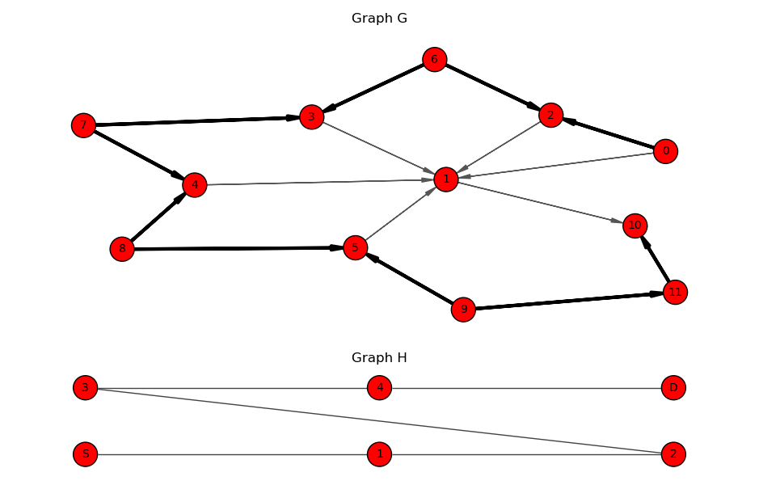

# Simulation of Key Dissemination Algorithm

|  |
|:--:|
| Figure1: Network G with alternating path (in bold) for `source=0` and `target=10`. Graph H is used to find the alternating. **Note**: Vertex numbering for graph G and H are not correlated. |

## Introduction

This project is intended to simulate the `secret` sharing and `key` dissemation schemes present in [1].

* `Secret sharing`: The sources, $S$, and targets, $D$, in a network, $G=(V,E)$, can know the message (secret). No other single node, $V\backslash \{S,D\}$, gains any information about the secret. 
* `Key dissemination`: Only the targets can know the message (key $K$). Other vertices in $G$ don't gain information about $K$.

Currently, this project only intends to implement secret sharing for one cut-vertex. Theorectically, implementing to multiple cut-vertices in not much more complicated, as it is essentially the one cut-vertex case repeated with some book keeping. However, effort is being focused on key disemination and analyzing the likelihood of there existing a structure for the scheme on various network types.

## To Do

### Must

- [x] Algorithm to find an alternating path
- [ ] Organize this project using best practices 
  - https://docs.python-guide.org/writing/structure/
- [ ] Provide documentation (want to organize project more before this)
- [ ] Check ability to find alternating paths on various graphs
  - [ ] Barabasi-Albert model
  - [ ] Watts-Strogatz model
  - [ ] Catalog of real-world graphs: 
    - https://networks.skewed.de/
    - http://konect.cc/
- [ ] Implement "matrix algorithm" that was discussed for finding if a `key` can be shared to N targets.

### Optional

- [ ] Implement primitives as classes. For example, make a class `SecretSharingPrimive` that inherits from `ig.Graph`. I think this may be a better way to organize things.
- [ ] Determine scope of analysis. If we are working with very large networks, we may want to use a library with better performance. For example, `Graph-tool` or `Networkit`. Likely unnecessary. See [NetworkToolsBrainstorm.md](NetworkToolsBrainstorm.md)

## Sources

1. Michael Langberg, Michelle Efros, "Characterizing positive-rate key-cast (and multicast network coding) with eavesdropping nodes", arXiv:2407.01703v1 [cs.IT], 2024.
